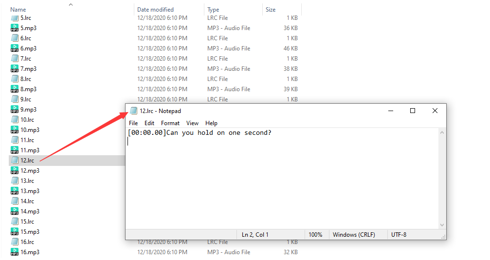
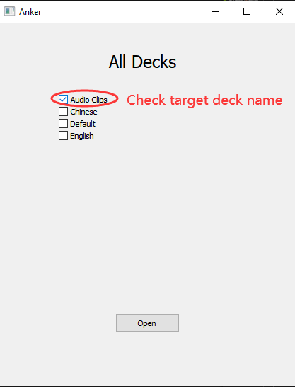
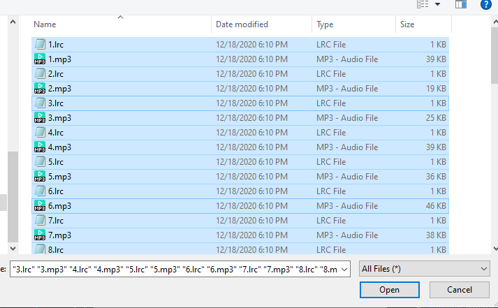
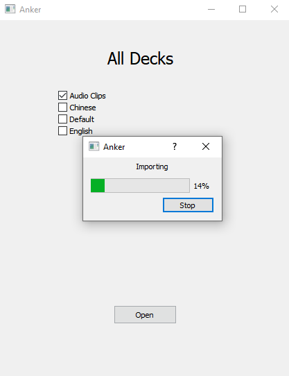

# Why Anker ?
Anker is a helper for [Anki](https://apps.ankiweb.net/) with the purpose of facilitating the creation of cards in Anki. Currently, it only serves as a bridge between Anki and [Aboboo](https://www.aboboo.com/). These two softwares are my best friends in learning English language. I highly recommend you guys to try them out :)

## To be more clear
Listen a specific dialog audio clip over and over again is critical in learning language. Aboboo can help you learn each dialog in detail and also output those dialogs in the form of <mp3, lrc> pair. For example, `12.lrc` - "Can you hold on one second?" correspondes with the `12.mp3`. Open `12.mp3` under resources folder for check.

 While Anki will remind you to review what you have listened timely, which forms a complete learning process. In my case, I prefer put the audio in the front and corresponding text in the back. It's time-consuming to make each card manually especially you have so many audio clips to learn. Here comes the rescue, Anker will do the legwork for you. 

## How to use ?
1. Run Anki first
2. Run anker-win32.exe
3. Select deck to be imported. BTW: I have to admit that the UI design is ugly :)

4. Click "Open" button and select all mp3 and lrc files output from Aboboo. Then click "Open" button.

5. Waiting for importing

6. Done

# Third-party libraries
* [Qt5](https://www.qt.io/) Graphics User Interface.
* [cpp-httplib](https://github.com/yhirose/cpp-httplib) Parse/Generate HTTP request/response.
* [jsoncpp](https://github.com/open-source-parsers/jsoncpp) Parse/Generate Json objects.
* [googletest](https://github.com/google/googletest) Unit Testing